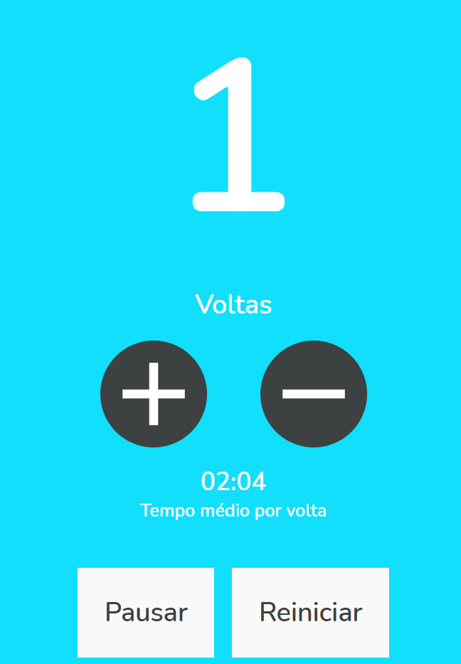

  
  <h1 align='center'> Contador de voltas </h1>

  <p align='center'>
    
  </p>
  <br> 
  
  
  

# 🔗Indice 
- [Sobre](#-Sobre)
- [Tecnologias utilizadas](#-Tecnologias)
- [Como baixar o projeto](#-Como-baixar-o-projeto)

<br>

## 📝Sobre  
<p> 
    Projeto feito pra fixar os conceitos de UseEffect e UseState em ReactJS, onde temos um contador de voltas que também calcula média por volta, e totalmente responsivel.  você consegue acessar o projeto em funcionamento no Link abaixo: 
</p>

<h2 align='center' > 

 [Contador de voltas](https://w84l8.csb.app/) 

</h2>


---

## 🚀 Tecnologias

<p>O projeto foi desenvolvido utilizando as seguintes tecnologias:</p>


- [ReactJS](https://reactjs.org/)  

- [CSS](https://developer.mozilla.org/en-US/docs/Web/CSS)   

---

## 📂Como baixar o projeto

````bash
# Clonar o repositório
$ git clone https://github.com/gabriel-elesbao/podcastr-NLW5.git

# Entrar no diretório 
$ cd contador-de-voltas

#instalar as dependências 
$ yarn install

#rodar  aplicação
$ yarn start 

````
<h3> O app estará disponivel no seu navegador em <h3> 

`http://localhost:3000`


Desenvolvido 💻 por Gabriel Oliveira

---
 👋 Check out my Linkedin


  [   ](https://www.linkedin.com/in/gabriel-oliveira97/) 
  


​		


